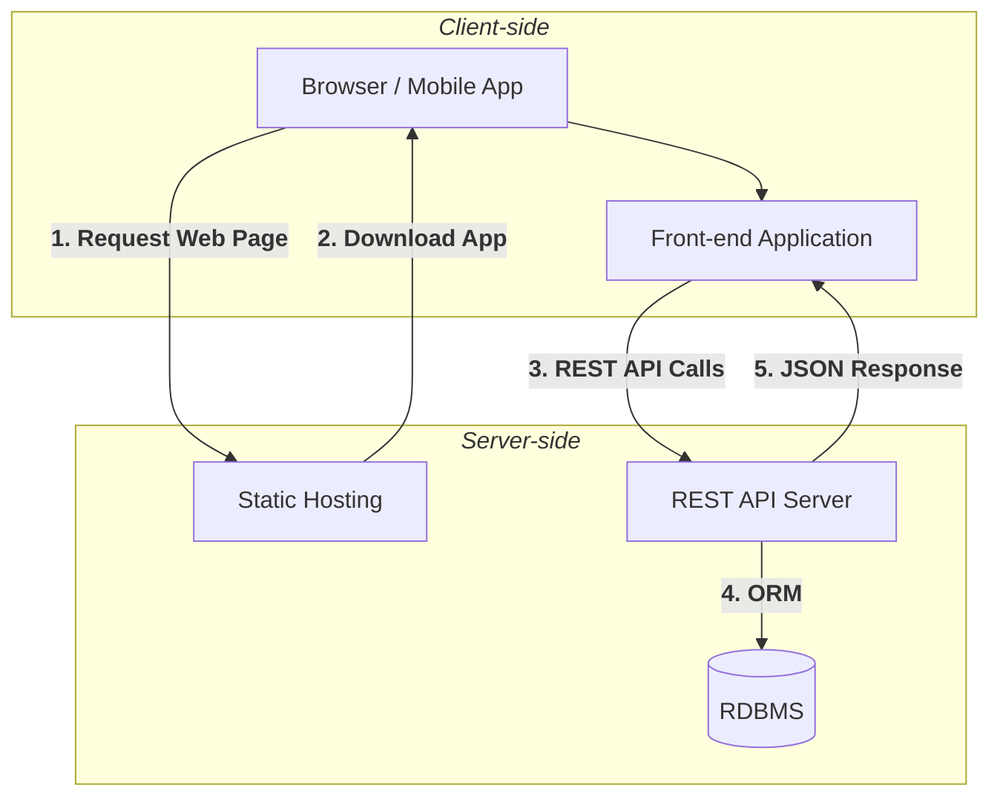

# Fur & Feather
<p style="text-align: justify;">
<i>Fur and Feather</i> is a web and mobile-based application that connects adopters, shelters, and administrators through a centralized adoption management system. This document presents the high-level architecture, project organization, and development strategy for the platform.
</p>

## 1. Project Overview
The platform provides the following core functionalities:
- **Enable pet shelters to list adoptable pets** that registered users can browse and choose from.
- **Let users apply for adoption** by sending a standard application from their account.
- **Help admins manage received applications** and guide users through the care routine of their chosen pet, if they are deemed eligible for adoption.

## 2. Functional Requirements
The initial functional requirements are categorized according to the three primary user roles:
- **Adopters:**
    - Account creation and management.
    - Browse pet listings through multiple filters like: breed, species, age, name, etc.
    - View pet details.
    - Submit adoption applications for review.
    - Track application status and receive updates on developments.

- **Shelters:**
    - Account creation and management.
    - CRUD operations on pet listings.
    - Access and management of applications received for their respective pets.

- **Admin:**
    - Moderate pet listings.
    - Review and approve/reject adoptions.
    - Add/edit static content (guides, steps).

## 3. System Architecture
Following is the preliminary architecture of the platform:



## 4. Component Responsibilities
Project development is divided amongst the group based on the features of each end:

- **Back-end team:**
    - Business logic and APIs.
    - Authentication and authorization.
    - CRUD operations.
    - Validation.
    - Database management.
    - Admin panel.
    - Back-end testing.
    - Back-end Dockerfile.

- **Front-end team:**
    - User interface.
    - Forms.
    - API integration.
    - Data presentation.
    - Front-end testing.
    - Front-end Dockerfile.

- **Shared:**
    - Git and GitHub.
    - Documentation.
    - Pull Requests.
    - Docker Compose.

## 5. Technology Stack
An initial list of necessary technologies that'll be used for development is given below:

| Layer | Technology |
|-------|------------|
|Back-end|Django, DRF|
|Front-end|React, HTML, CSS|
|Database|PostgreSQL|
|Containerization|Docker|
|Version Control|Git, GitHub|

## 6. Project Structure
<p style="text-align: justify;">
The project will be organized according to the following tree for clear separation of concerns and effective management so that each team can develop their respective sides independently without colliding with others:
</p>

```
pet-adoption-platform/
├── backend/
│   ├── accounts/
│   ├── applications/
│   ├── guides/
│   ├── pets/
│   ├── ...
│   ├── config/
│   ├── .env
│   ├── Dockerfile
│   ├── manage.py
│   └── requirements.txt
├── frontend/
│   ├── public/
│   ├── src/
│   ├── ...
│   ├── Dockerfile
│   └── package.json
├── docs/
│   ├── api.md
│   ├── erd.png
│   └── hld.md
├── .gitignore
├── README.md
└── docker-compose.yml
```

## 7. Development Workflow
<p style="text-align: justify;">
Each member of the team will be assigned a branch in the Git repo exclusive to them. Members will build their chosen features and after local testing and review, submit a pull request in the main branch to have their additions/changes integrated. Thus, the proposed tree structure of the Git repo is:
</p>

```
main
├── backend/angsh
├── backend/kuntal
├── ...
├── frontend/madhurima
└── frontend/ritashman
```
Each member **should synchronize their branch with `main`** before beginning new work and before opening a Pull Request to minimize merge conflicts.

## 8. Deployment Strategy
Post project development, deployment is proposed using:
1. Virtual servers for compute.
2. Remote container registry.
3. Object-based cloud storage.